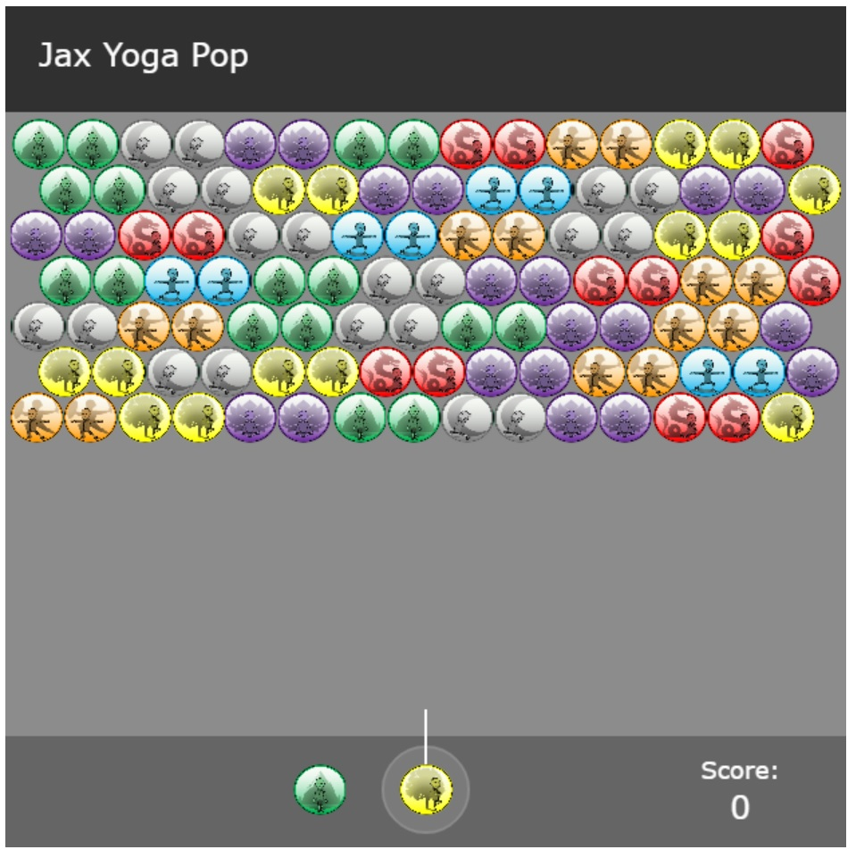

# Jax Yoga Pop

https://jaxpi.github.io/jax-yoga-pop/   

## Description

This a very simple bubble shooter game created with only HTML and JavaScript. It allows users to try to clear the board of all bubbles by shooting new bubbles at groups of the same color. When 3 or more bubbles of the same color are connected they disappear. If there are any bubbles attached to the group only by other bubbles that disappear then they will fall also. Those bubbles attached to the top of the gameboard will not fall, only disappear upon aggregation. The rows of bubbles will continuously shift down and a new row added to the top after a certain number of moves. If the bottom row of bubbles reaches the bottom of the game board then the game ends. The user can see their score at the bottom of the game and begin a new game after "game over" by clicking on the gameboard.

## Installation

There is no installation needed, the game can be played in the browser as-is.

## Usage

To use, simply open the application in a browser window and begin by aiming the current bubble at the cluster and clicking to shoot it. The goal is to hit another bubble of the same color to make a cluster of at least 3 so they can disappear until all bubbles are gone. Refreshing the page will reset the game to another random cluster.

## Credits

This project was created following the tutorial of the article "Bubble Shooter Game Tutorial with HTML5 and JavaScript" from Rembound.com. The links to the article and the GitHub repository are included below.

https://rembound.com/articles/bubble-shooter-game-tutorial-with-html5-and-javascript  
https://github.com/rembound/Bubble-Shooter-HTML5

## License

MIT License

Copyright (c) 2022 Jackson Impellizeri

Permission is hereby granted, free of charge, to any person obtaining a copy
of this software and associated documentation files (the "Software"), to deal
in the Software without restriction, including without limitation the rights
to use, copy, modify, merge, publish, distribute, sublicense, and/or sell
copies of the Software, and to permit persons to whom the Software is
furnished to do so, subject to the following conditions:

The above copyright notice and this permission notice shall be included in all
copies or substantial portions of the Software.

THE SOFTWARE IS PROVIDED "AS IS", WITHOUT WARRANTY OF ANY KIND, EXPRESS OR
IMPLIED, INCLUDING BUT NOT LIMITED TO THE WARRANTIES OF MERCHANTABILITY,
FITNESS FOR A PARTICULAR PURPOSE AND NONINFRINGEMENT. IN NO EVENT SHALL THE
AUTHORS OR COPYRIGHT HOLDERS BE LIABLE FOR ANY CLAIM, DAMAGES OR OTHER
LIABILITY, WHETHER IN AN ACTION OF CONTRACT, TORT OR OTHERWISE, ARISING FROM,
OUT OF OR IN CONNECTION WITH THE SOFTWARE OR THE USE OR OTHER DEALINGS IN THE
SOFTWARE.
